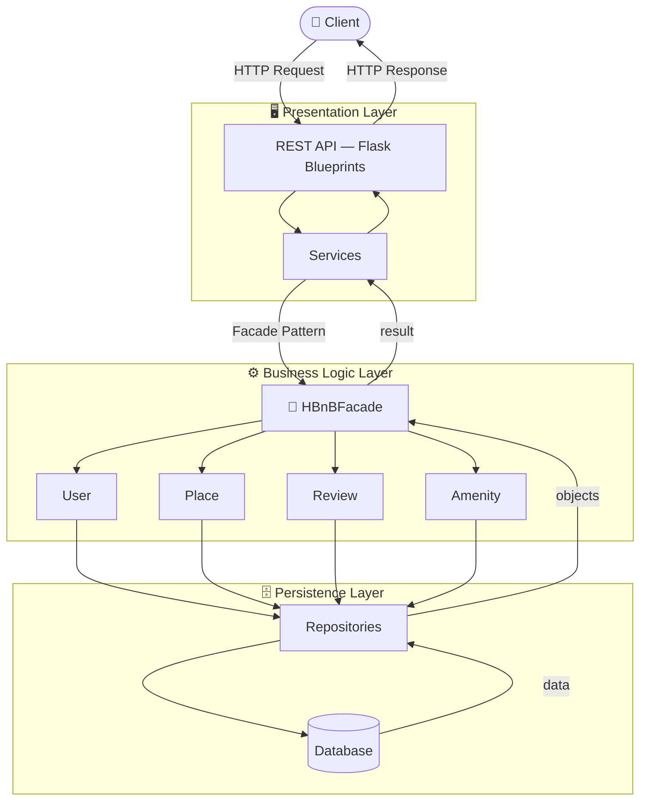
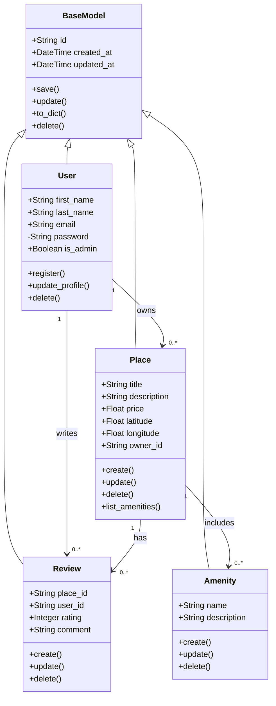
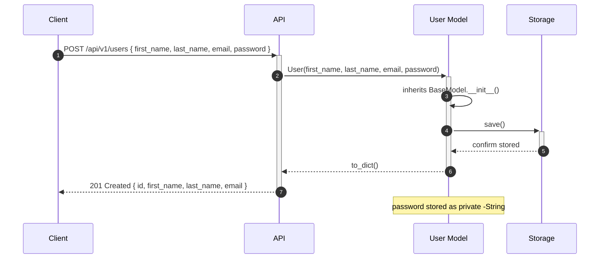
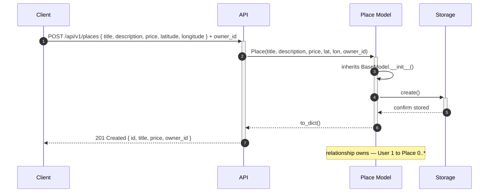
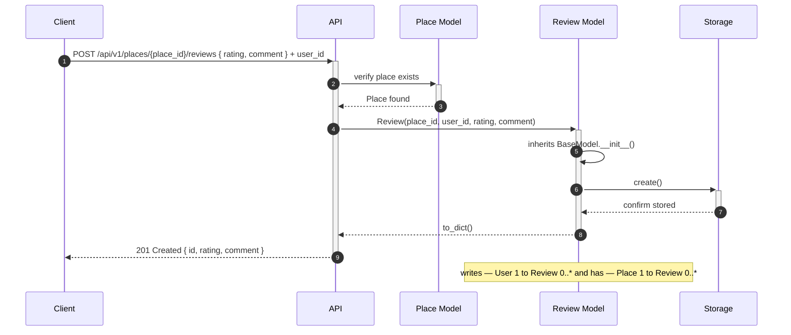
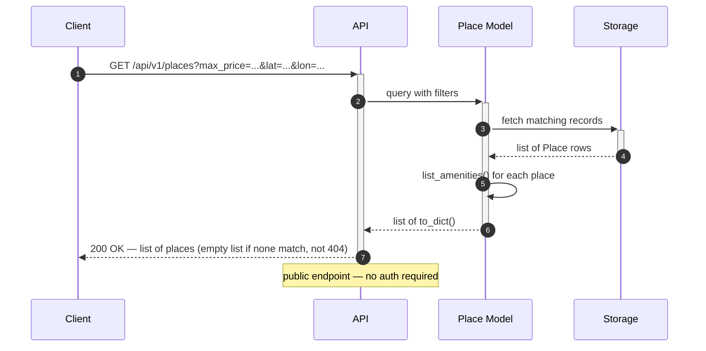

<div align="center">

# 🏠 HBnB Evolution

### *A full-stack accommodation rental platform — built from scratch at Holberton School*

<br/>


<br/>

> *"HBnB Evolution takes the concepts behind Airbnb and rebuilds them from the ground up —*
> *with clean architecture, real design decisions, and code that's meant to last."*

</div>

---

## 📖 What Is This?

HBnB Evolution is a back-end application that replicates the core experience of a short-term rental platform. People can register accounts, create place listings, browse what's available, leave reviews, and attach amenities to any property.

But more than a feature list, this project is an exercise in **building things properly** — making design decisions early that hold up under pressure, keeping layers separated so that changing one thing doesn't break three others, and writing a system that a new developer can pick up and understand without a guide.

The project is built in phases, each one extending the previous. Phase one is architecture and design — the diagrams and documentation that define *how* the system will be built before a single route is written. Phase two is the API and business logic. Phase three brings in a real database. Every choice made in phase one carries through to the end.

---

## 🏗️ Architecture

HBnB is built as a **three-layer system** with the **Facade pattern** sitting between the layers.



### Why Three Layers?

Each layer has exactly **one responsibility**, and they only talk to each other in one direction:

| Layer | Job | What it doesn't do |
|-------|-----|---------------------|
| **Presentation** | Parse requests, format responses | No business rules |
| **Business Logic** | Validate, enforce rules, coordinate entities | No direct DB calls |
| **Persistence** | Read and write storage | No business logic |

### Why a Facade?

Instead of the API calling User, Place, Review, and Amenity directly, **every call goes through HBnBFacade**. The API asks for one thing; the facade figures out which entities and queries are needed. This means:

- The API never breaks when internal logic changes
- The facade can be mocked for testing without touching the database
- New features get added in one place, not scattered across four classes

---

## 🧬 Data Model

Every entity inherits from **BaseModel**, which handles identity and lifecycle for free:



---

## 🔄 API Flows

### 1 — User Registration



### 2 — Place Creation



### 3 — Review Submission



### 4 — Fetching a List of Places



---

## 🛣️ API Reference

| Method | Endpoint | Description | Auth |
|--------|----------|-------------|------|
| `POST` | `/api/v1/users` | Register a new user | ❌ Public |
| `GET` | `/api/v1/users/{id}` | Get a user by ID | ✅ |
| `PUT` | `/api/v1/users/{id}` | Update a user profile | ✅ |
| `POST` | `/api/v1/places` | Create a new place listing | ✅ |
| `GET` | `/api/v1/places` | List places (filterable) | ❌ Public |
| `GET` | `/api/v1/places/{id}` | Get a specific place | ❌ Public |
| `PUT` | `/api/v1/places/{id}` | Update a place | ✅ Owner |
| `DELETE` | `/api/v1/places/{id}` | Delete a place | ✅ Owner |
| `POST` | `/api/v1/places/{id}/reviews` | Submit a review | ✅ |
| `GET` | `/api/v1/places/{id}/reviews` | Get reviews for a place | ❌ Public |
| `POST` | `/api/v1/amenities` | Create an amenity | ✅ Admin |
| `GET` | `/api/v1/amenities` | List all amenities | ❌ Public |

---

## 📁 Project Structure

```
holbertonschool-hbnb/
│
├── app/
│   ├── api/v1/               # Presentation layer — Flask routes
│   │   ├── users.py
│   │   ├── places.py
│   │   ├── reviews.py
│   │   └── amenities.py
│   │
│   ├── models/               # Business logic layer — entity classes
│   │   ├── base_model.py     # Shared parent: id, timestamps, lifecycle
│   │   ├── user.py
│   │   ├── place.py
│   │   ├── review.py
│   │   └── amenity.py
│   │
│   ├── services/
│   │   └── facade.py         # HBnBFacade — single entry point for all logic
│   │
│   └── persistence/
│       ├── repository.py     # Abstract repository interface
│       └── in_memory.py      # In-memory store (Phase 1)
│
├── docs/                     # Architecture diagrams & full technical docs
├── tests/                    # Unit and integration tests
├── config.py
├── requirements.txt
└── README.md
```

---

## 🚀 Getting Started

**Requirements:** Python 3.10+

```bash
# Clone the repository
git clone https://github.com/strewili/holbertonschool-hbnb.git
cd holbertonschool-hbnb

# Create and activate a virtual environment
python3 -m venv venv
source venv/bin/activate

# Install dependencies
pip install -r requirements.txt

# Start the server
python3 -m app
```

The API will be available at **`http://localhost:5000`**

```bash
# Run the test suite
python3 -m pytest tests/ -v
```

---

## 📚 Documentation

Full technical documentation — package diagram, class diagram, and sequence diagrams for all four API flows — lives in [`/docs`](./docs/).

---
Repository Information
* GitHub repository: holbertonschool-hbnb
* Directory: part1
  
Conclusion
This technical documentation provides a clear foundation for the HBnB Evolution application. It explains the system architecture, business logic structure, and API interaction flow, which will guide the implementation in the next phases of the project.

## 👩‍💻 Authors

| Name | GitHub |
|------|--------|
| **Jana Alhazmi** | [](https://github.com/Jana-Alhazmi) |
| **Shouq Alqarni** | [](https://github.com/strewili) |
| **Kayan Alnazari** | [](https://github.com/Kayan-Alnazari) |

---

<div align="center">
<sub>Built with care as part of the Holberton School Software Engineering program.</sub>
</div>
