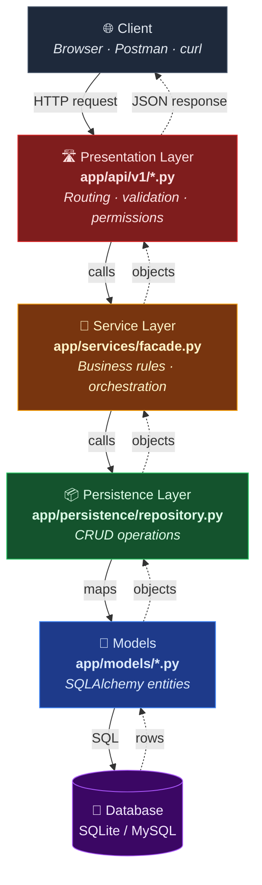
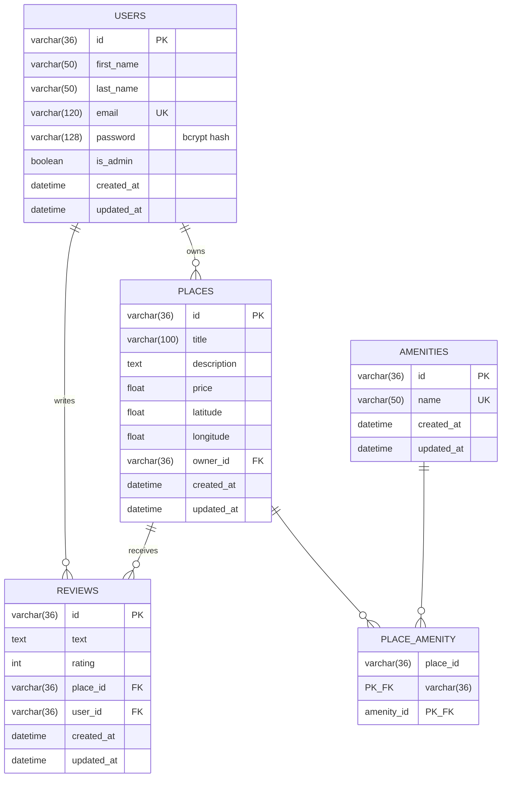
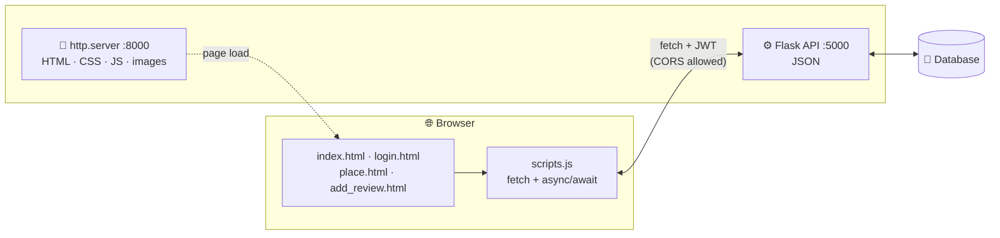

<div align="center">

# 🏡 HBnB — Holberton BnB

**A full-stack rental platform — built from UML blueprint, to a secured database-backed API, to a web client you can actually click.**

[](https://www.python.org/)
[](https://flask-restx.readthedocs.io/)
[](https://www.sqlalchemy.org/)
[](https://jwt.io/)
[](https://www.sqlite.org/)
[](https://developer.mozilla.org/en-US/docs/Web/JavaScript)

*Holberton School — Full-Stack Software Engineering*

</div>

---

## 📖 Table of Contents

- [What is HBnB?](#-what-is-hbnb)
- [Project Journey](#-project-journey)
- [Architecture](#-architecture)
- [Database Schema](#-database-schema)
- [Repository Structure](#-repository-structure)
- [Getting Started](#-getting-started)
- [API Reference](#-api-reference)
- [Quickstart: A Complete Walkthrough](#-quickstart-a-complete-walkthrough)
- [Business Rules](#-business-rules)
- [Raw SQL Schema (Task 9)](#-raw-sql-schema-task-9)
- [The Web Client (Part 4)](#-the-web-client-part-4)
- [Testing](#-testing)
- [Project Status](#-project-status)
- [Team](#-team)

---

## 🌍 What is HBnB?

HBnB is a simplified clone of Airbnb's backend. It exposes a REST API that lets users register, log in, list properties for rent, tag those properties with amenities, and leave reviews on places they've stayed at.

The interesting part isn't the feature list — it's the **architecture**. The project is deliberately built in layers, so that the code handling HTTP requests knows nothing about the database, and the code talking to the database knows nothing about HTTP. That separation is what makes the project realistic, testable, and easy to extend.

**Core entities:**

| Entity | What it represents |
|---|---|
| 👤 **User** | Someone who can own places and write reviews |
| 🏠 **Place** | A property listing owned by exactly one user |
| ⭐ **Review** | A rating + comment written by a user about a place |
| 🛎️ **Amenity** | A feature (WiFi, Pool…) that any number of places can offer |

---

## 🚀 Project Journey

The project was built in four progressive parts, each one adding a layer of realism.

### 📐 Part 1 — Technical Documentation

Before a single line of code, the system was designed on paper: what the classes are, how they relate, and how a request flows through the system.

| Deliverable | File |
|---|---|
| High-Level Package Diagram | [`High-Level Package Diagram.pdf`](part1/High-Level%20Package%20Diagram.pdf) |
| Detailed Class Diagram | [`class_diagram_hbnb.pdf`](part1/class_diagram_hbnb.pdf) |
| Sequence — User Registration | [`User Registration.png`](part1/User%20Registration.png) |
| Sequence — Place Creation | [`Place Creation.png`](part1/Place%20Creation.png) |
| Sequence — Review Submission | [`Review Submission.png`](part1/Review%20Submission.png) |
| Sequence — Fetching a List of Places | [`Fetching a List of Places.png`](part1/Fetching%20a%20List%20of%20Places.png) |
| Full compiled documentation | [`HBnB_Uml_Documentation.docx`](part1/HBnB_Uml_Documentation.docx) |

### ⚙️ Part 2 — Business Logic & API Endpoints

The blueprint became working code: models, the Facade layer, an in-memory repository, and full CRUD endpoints — no database and no authentication yet, so the focus stayed on clean structure and correct behaviour.

> ⚠️ **Note:** Part 2's source files are only partially committed in this repository (see [Project Status](#-project-status)). Part 3 is the complete, runnable version of the application.

### 🔐 Part 3 — Authentication & Database

The application became production-shaped:

- **Password hashing** with `bcrypt` — plaintext passwords are never stored
- **JWT authentication** — stateless login with `is_admin` embedded as a token claim
- **Role-based authorization** — owner-only and admin-only rules on every mutating endpoint
- **SQLAlchemy ORM** — the in-memory repository swapped for a real, persistent database
- **Raw SQL schema** — the same database rebuilt by hand in pure SQL, plus an ERD

### 🌊 Part 4 — Simple Web Client *(current)*

Everything built so far was invisible — the only way to see it was Swagger or `curl`.
Part 4 gives the API a face: a browsable site built with **HTML5, CSS3 and vanilla
JavaScript ES6**, talking to the Part 3 backend over the **Fetch API**, with no page
reloads anywhere.

- **Login** — email + password exchanged for a JWT, stored in a cookie
- **List of places** — cards rendered live from `GET /places/`, with a client-side price filter
- **Place details** — one page serving every place, selected by `?place_id=` in the URL
- **Add review** — a guarded form that POSTs with the token attached
- **A real design** — navy palette, Poppins, hotel photography, W3C-validated markup

📄 **[Full Part 4 documentation →](part4_shouq/README.md)**

---

## 🧭 Architecture

HBnB follows a **layered architecture** using the **Facade** and **Repository** patterns. Each request travels down through the layers, and each layer only ever talks to the one directly beneath it.


```mermaid
flowchart TD
    Client["🌐 Client<br/><i>Browser · Postman · curl</i>"]
    API["🛣️ Presentation Layer<br/><b>app/api/v1/*.py</b><br/><i>Routing · validation · permissions</i>"]
    Facade["🧠 Service Layer<br/><b>app/services/facade.py</b><br/><i>Business rules · orchestration</i>"]
    Repo["📦 Persistence Layer<br/><b>app/persistence/repository.py</b><br/><i>CRUD operations</i>"]
    Models["🧱 Models<br/><b>app/models/*.py</b><br/><i>SQLAlchemy entities</i>"]
    DB[("💾 Database<br/>SQLite / MySQL")]

    Client -->|HTTP request| API
    API -->|calls| Facade
    Facade -->|calls| Repo
    Repo -->|maps| Models
    Models -->|SQL| DB
    DB -.->|rows| Models
    Models -.->|objects| Repo
    Repo -.->|objects| Facade
    Facade -.->|objects| API
    API -.->|JSON response| Client

    style Client fill:#1e293b,stroke:#475569,color:#e2e8f0
    style API fill:#7f1d1d,stroke:#dc2626,color:#fee2e2
    style Facade fill:#78350f,stroke:#f59e0b,color:#fef3c7
    style Repo fill:#14532d,stroke:#22c55e,color:#dcfce7
    style Models fill:#1e3a8a,stroke:#3b82f6,color:#dbeafe
    style DB fill:#3b0764,stroke:#a855f7,color:#f3e8ff
```

**Why this matters:** to switch from SQLite to PostgreSQL, you change one connection string in `config.py`. The API layer, the Facade, and the business rules never notice. That's the payoff of separating layers.

### The role of each layer

| Layer | Responsibility | Never does |
|---|---|---|
| **API** (`api/v1/`) | Parse requests, validate shape, check permissions, return status codes | Touch the database directly |
| **Facade** (`services/`) | Enforce business rules, coordinate across entities | Know anything about HTTP |
| **Repository** (`persistence/`) | Save, fetch, update, delete | Contain business rules |
| **Models** (`models/`) | Define entity structure and relationships | Handle requests or queries |

---

## 💾 Database Schema

All entities inherit `id` (UUID), `created_at`, and `updated_at` from a shared `BaseModel`.


```mermaid
erDiagram
    USERS ||--o{ PLACES : "owns"
    USERS ||--o{ REVIEWS : "writes"
    PLACES ||--o{ REVIEWS : "receives"
    PLACES ||--o{ PLACE_AMENITY : ""
    AMENITIES ||--o{ PLACE_AMENITY : ""

    USERS {
        varchar(36) id PK
        varchar(50) first_name
        varchar(50) last_name
        varchar(120) email UK
        varchar(128) password "bcrypt hash"
        boolean is_admin
        datetime created_at
        datetime updated_at
    }

    PLACES {
        varchar(36) id PK
        varchar(100) title
        text description
        float price
        float latitude
        float longitude
        varchar(36) owner_id FK
        datetime created_at
        datetime updated_at
    }

    REVIEWS {
        varchar(36) id PK
        text text
        int rating
        varchar(36) place_id FK
        varchar(36) user_id FK
        datetime created_at
        datetime updated_at
    }

    AMENITIES {
        varchar(36) id PK
        varchar(50) name UK
        datetime created_at
        datetime updated_at
    }

    PLACE_AMENITY {
        varchar(36) place_id PK_FK
        varchar(36) amenity_id PK_FK
    }
```

**Relationship types at a glance:**

- **One-to-Many** — one `User` owns many `Places`; one `Place` receives many `Reviews`
- **Many-to-Many** — a `Place` offers many `Amenities`, and an `Amenity` belongs to many `Places`, joined through the `place_amenity` association table

📊 A rendered ERD is also available at [`part3/10-hbnb_erd.png`](part3/10-hbnb_erd.png).

---

## 📁 Repository Structure

```
holbertonschool-hbnb/
│
├── part1/                          # 📐 UML documentation & diagrams
│   ├── High-Level Package Diagram.pdf
│   ├── class_diagram_hbnb.pdf
│   ├── User Registration.png
│   ├── Place Creation.png
│   ├── Review Submission.png
│   ├── Fetching a List of Places.png
│   └── HBnB_Uml_Documentation.docx
│
├── part2/                          # ⚙️ In-memory API (see Project Status)
│   ├── app/
│   │   ├── api/v1/                 #    REST endpoints
│   │   ├── persistence/            #    In-memory repository
│   │   ├── services/               #    Facade
│   │   └── run.py
│   └── tests/                      #    unittest suite
│
├── part3/                          # 🔐 Auth + database (complete app)
    ├── app/
    │   ├── api/v1/
    │   │   ├── auth.py             #    POST /login → JWT
    │   │   ├── users.py            #    User endpoints
    │   │   ├── places.py           #    Place endpoints
    │   │   ├── reviews.py          #    Review endpoints
    │   │   └── amenities.py        #    Amenity endpoints (admin-gated)
    │   ├── models/
    │   │   ├── base_model.py       #    Shared id / timestamps
    │   │   ├── user.py             #    + password hashing
    │   │   ├── place.py            #    + place_amenity join table
    │   │   ├── review.py
    │   │   └── amenity.py
    │   ├── persistence/
    │   │   ├── repository.py       #    Abstract + SQLAlchemy repositories
    │   │   └── user_repository.py  #    User-specific queries
    │   ├── services/
    │   │   └── facade.py           #    Business logic hub
    │   ├── config.py               #    Environment configuration
    │   ├── extensions.py           #    Shared bcrypt / jwt / db instances
    │   ├── utils.py                #    @admin_required decorator
    │   ├── __init__.py             #    Application factory
    │   └── run.py                  #    Entry point
    ├── create_admin.py             # 🔑 Seed script — creates the first admin
│   ├── 9-hbnb_schema.sql           # 🗄️ Raw SQL schema + initial data
│   ├── 10-hbnb_erd.png             # 📊 Entity-relationship diagram
│   └── requirements.txt
│
└── part4_shouq/                    # 🌊 Web client (HTML / CSS / JS + the API)
    ├── index.html                  #    Task 2 — list of places + price filter
    ├── login.html                  #    Task 1 — login form
    ├── place.html                  #    Task 3 — details + reviews
    ├── add_review.html             #    Task 4 — standalone review form
    ├── styles.css                  #    Navy design system (CSS variables)
    ├── scripts.js                  #    All client logic — tasks 1 to 4
    ├── images/                     #    Logo, amenity icons, photography
    ├── app/                        #    The Part 3 API, copied in + CORS
    ├── config.py                   #    Dev / Testing / Production configs
    ├── run.py                      #    API entry point
    ├── seed_data.py                #    Demo users, places and reviews
    └── README.md                   #    Part 4 documentation
```

---

## 🚦 Getting Started

### Prerequisites

- Python 3.8+
- `pip`
- *(Optional)* MySQL — only needed for the raw SQL task

### Installation

```bash
# 1. Clone the repository
git clone https://github.com/strewili/holbertonschool-hbnb.git
cd holbertonschool-hbnb/part3

# 2. Create a virtual environment (recommended)
python3 -m venv venv
source venv/bin/activate          # Windows: venv\Scripts\activate

# 3. Install dependencies
pip install -r requirements.txt
```

> 💡 **If `mysqlclient` fails to install:** it needs system-level MySQL headers and is only required for the MySQL task. To run the app on SQLite, you can safely install the rest without it.

### Running the server

```bash
# From the part3/ directory
python3 -m app.run
```

The API is now live at **`http://127.0.0.1:5000`**.

### 📚 Interactive documentation

Open **<http://127.0.0.1:5000/api/v1/>** in your browser. Flask-RESTx generates a full **Swagger UI** where every endpoint can be explored and executed — no Postman required.

### Creating the first admin

Some endpoints are admin-only, and there's no way to self-promote through the API (by design). Seed an admin account:

```bash
# From the part3/ directory
python3 create_admin.py
```

This creates **`admin@test.com`** / **`123456`** with `is_admin = True`.

> ⚠️ These are development credentials. Change them before deploying anywhere real.

### Configuration

`app/config.py` reads from environment variables with sensible fallbacks:

| Variable | Default | Purpose |
|---|---|---|
| `SECRET_KEY` | `default_secret_key` | Flask session signing |
| `JWT_SECRET_KEY` | `jwt-super-secret-key` | JWT signing key |
| `DATABASE_URL` | `sqlite:///hbnb.db` | Database connection string |
| `FLASK_CONFIG` | `default` | Which config class to load |

---

## 📡 API Reference

**Base URL:** `http://127.0.0.1:5000/api/v1`

Protected endpoints expect a header of the form:

```
Authorization: Bearer <your_access_token>
```

### 🔐 Authentication

| Method | Endpoint | Auth | Description |
|:---:|---|:---:|---|
| `POST` | `/auth/login` | 🌐 Public | Exchange email + password for a JWT |

### 👤 Users

| Method | Endpoint | Auth | Description |
|:---:|---|:---:|---|
| `POST` | `/users/` | 🌐 Public | Register a new user |
| `GET` | `/users/` | 🌐 Public | List all users |
| `GET` | `/users/<user_id>` | 🌐 Public | Retrieve a single user |
| `PUT` | `/users/<user_id>` | 🔒 Self or 👑 Admin | Update a user |

> 🔎 Non-admins may only edit **their own** account, and may **not** change `email` or `password`. Passwords are never returned in any response.

### 🏠 Places

| Method | Endpoint | Auth | Description |
|:---:|---|:---:|---|
| `POST` | `/places/` | 🔒 Authenticated | Create a place *(you become the owner)* |
| `GET` | `/places/` | 🌐 Public | List all places |
| `GET` | `/places/<place_id>` | 🌐 Public | Place details + owner + amenities |
| `PUT` | `/places/<place_id>` | 🔑 Owner or 👑 Admin | Update a place |
| `DELETE` | `/places/<place_id>` | 🔑 Owner or 👑 Admin | Delete a place |

> 🔎 `owner_id` is taken from your JWT, never from the request body — you cannot create a listing in someone else's name.

### ⭐ Reviews

| Method | Endpoint | Auth | Description |
|:---:|---|:---:|---|
| `POST` | `/reviews/` | 🔒 Authenticated | Write a review |
| `GET` | `/reviews/` | 🌐 Public | List all reviews |
| `GET` | `/reviews/<review_id>` | 🌐 Public | Retrieve a single review |
| `PUT` | `/reviews/<review_id>` | ✍️ Author or 👑 Admin | Update a review |
| `DELETE` | `/reviews/<review_id>` | ✍️ Author or 👑 Admin | Delete a review |

### 🛎️ Amenities

| Method | Endpoint | Auth | Description |
|:---:|---|:---:|---|
| `POST` | `/amenities/` | 👑 Admin only | Create an amenity |
| `GET` | `/amenities/` | 🌐 Public | List all amenities |
| `GET` | `/amenities/<amenity_id>` | 🌐 Public | Retrieve a single amenity |
| `PUT` | `/amenities/<amenity_id>` | 👑 Admin only | Update an amenity |

### Status codes

| Code | Meaning in this API |
|:---:|---|
| `200` | Request succeeded |
| `201` | Resource created |
| `400` | Invalid input — bad payload, duplicate email, or a violated business rule |
| `401` | Missing, malformed, or expired token — or wrong login credentials |
| `403` | Authenticated, but not allowed *(not the owner / not an admin)* |
| `404` | Resource does not exist |

---

## ⚡ Quickstart: A Complete Walkthrough

Follow these five steps to exercise the whole API from a terminal.

**1️⃣ Register a user**

```bash
curl -X POST http://127.0.0.1:5000/api/v1/users/ \
  -H "Content-Type: application/json" \
  -d '{
        "first_name": "Sara",
        "last_name": "Ahmed",
        "email": "sara@test.com",
        "password": "mypassword"
      }'
```

```jsonc
// 201 Created
{
  "id": "f8d5aa63-89e1-49c3-93cb-ff13d235af13",
  "first_name": "Sara",
  "last_name": "Ahmed",
  "email": "sara@test.com"
}
```

**2️⃣ Log in and capture the token**

```bash
curl -X POST http://127.0.0.1:5000/api/v1/auth/login \
  -H "Content-Type: application/json" \
  -d '{"email": "sara@test.com", "password": "mypassword"}'
```

```jsonc
// 200 OK
{ "access_token": "eyJhbGciOiJIUzI1NiIsInR5cCI6IkpXVCJ9..." }
```

Save it for the next calls:

```bash
TOKEN="paste_your_access_token_here"
```

**3️⃣ Create a place**

```bash
curl -X POST http://127.0.0.1:5000/api/v1/places/ \
  -H "Authorization: Bearer $TOKEN" \
  -H "Content-Type: application/json" \
  -d '{
        "title": "Beach Apartment",
        "description": "Sea view, 2 bedrooms",
        "price": 200,
        "latitude": 24.7136,
        "longitude": 46.6753,
        "amenities": []
      }'
```

```jsonc
// 201 Created
{
  "id": "9b2f...",
  "title": "Beach Apartment",
  "price": 200,
  "owner_id": "f8d5aa63-89e1-49c3-93cb-ff13d235af13"
}
```

**4️⃣ Browse places — no token needed**

```bash
curl http://127.0.0.1:5000/api/v1/places/
curl http://127.0.0.1:5000/api/v1/places/<place_id>
```

**5️⃣ Leave a review on someone else's place**

```bash
curl -X POST http://127.0.0.1:5000/api/v1/reviews/ \
  -H "Authorization: Bearer $TOKEN" \
  -H "Content-Type: application/json" \
  -d '{
        "text": "Wonderful stay, highly recommended!",
        "rating": 5,
        "place_id": "<place_id>"
      }'
```

### 🧪 Try the failure cases too

A good API is defined as much by what it *refuses*. Each of these **should** fail:

```bash
# ❌ 401 — creating a place without a token
curl -X POST http://127.0.0.1:5000/api/v1/places/ \
  -H "Content-Type: application/json" \
  -d '{"title": "No Auth", "price": 10, "latitude": 0, "longitude": 0, "amenities": []}'

# ❌ 400 — registering an email that already exists
curl -X POST http://127.0.0.1:5000/api/v1/users/ \
  -H "Content-Type: application/json" \
  -d '{"first_name":"Dup","last_name":"User","email":"sara@test.com","password":"x"}'

# ❌ 400 — reviewing a place you own yourself
curl -X POST http://127.0.0.1:5000/api/v1/reviews/ \
  -H "Authorization: Bearer $TOKEN" \
  -H "Content-Type: application/json" \
  -d '{"text":"Mine!","rating":5,"place_id":"<your_own_place_id>"}'

# ❌ 403 — creating an amenity as a non-admin
curl -X POST http://127.0.0.1:5000/api/v1/amenities/ \
  -H "Authorization: Bearer $TOKEN" \
  -H "Content-Type: application/json" \
  -d '{"name": "Gym"}'
```

---

## 📜 Business Rules

These constraints are enforced in the **Facade** and **API** layers, not left to the client:

| Rule | Enforced where | Response when violated |
|---|---|---|
| Email addresses must be unique | `api/v1/users.py` + DB `UNIQUE` | `400` |
| Passwords are hashed with bcrypt, never stored or returned in plaintext | `models/user.py` | — |
| A place's owner is taken from the JWT, not the request body | `api/v1/places.py` | — |
| You cannot review your own place | `services/facade.py` | `400` |
| Only the owner or an admin may edit or delete a place | `api/v1/places.py` | `403` |
| Only the author or an admin may edit or delete a review | `api/v1/reviews.py` | `403` |
| Only admins may create or modify amenities | `api/v1/amenities.py` | `403` |
| Non-admins cannot change their own email or password via `PUT /users` | `api/v1/users.py` | `400` |
| A place cannot reference an amenity that doesn't exist | `services/facade.py` | `400` |

---

## 🧾 Raw SQL Schema (Task 9)

Part 3 also rebuilds the exact same database **by hand in pure SQL** — no ORM involved. The point is to prove the schema is understood at the database level, not just through SQLAlchemy's abstraction.

```bash
# Create the schema and seed initial data
mysql -u root -p < part3/9-hbnb_schema.sql
```

**What [`9-hbnb_schema.sql`](part3/9-hbnb_schema.sql) does:**

- Creates the `hbnb_evaluation` database
- Defines all five tables with primary keys, `UNIQUE` constraints, and foreign keys
- Inserts an administrator account
- Inserts three starter amenities: *WiFi*, *Swimming Pool*, *Air Conditioning*

> ⚠️ The seeded admin's `password` column is a **placeholder string**, not a valid bcrypt hash — logging in with it will fail until you replace it with a real hash generated by bcrypt.

---

## 🌊 The Web Client (Part 4)

Part 4 lives in [`part4_shouq/`](part4_shouq/) and contains **both** the web client and a
copy of the Part 3 API, so the whole stack runs from one folder.

### Running it

Two terminals, both inside `part4_shouq/`:

```bash
# Terminal 1 — the API
python seed_data.py
python run.py                # http://127.0.0.1:5000

# Terminal 2 — the web client
python -m http.server 8000   # http://localhost:8000/index.html
```

> Pages must be served over `http://`. Opening them as `file://` makes the browser
> block every API request.

### How the two halves connect


```mermaid
flowchart LR
    subgraph Browser["🌐 Browser"]
        H["index.html · login.html<br/>place.html · add_review.html"]
        J["scripts.js<br/>fetch + async/await"]
    end
    subgraph Servers[" "]
        W["📄 http.server :8000<br/>HTML · CSS · JS · images"]
        A["⚙️ Flask API :5000<br/>JSON"]
    end
    DB[("💾 Database")]

    H --> J
    W -.->|"page load"| H
    J <-->|"fetch + JWT<br/>(CORS allowed)"| A
    A <--> DB
```

The browser downloads the **pages** from port 8000 and the **data** from port 5000.
Because those are different origins, the API must grant permission explicitly:

```python
CORS(app, resources={r"/api/*": {"origins": "*"}})
```

### The four tasks

| Task | Page | What it does |
|---|---|---|
| 1 | `login.html` | `POST /auth/login` → JWT saved in a cookie → redirect |
| 2 | `index.html` | `GET /places/` → cards built in JavaScript → price filter with **no** extra requests |
| 3 | `place.html` | Reads `?place_id=` from the URL → `GET /places/<id>` → details + reviews |
| 4 | `add_review.html` | `POST /reviews/` with `Authorization: Bearer <token>` |

### Three ideas that carry the whole thing

**`event.preventDefault()`** — a `<form>` reloads the page by default. Cancelling that is
the single line separating a modern app from a 1998 website.

**`authHeaders()`** — HTTP forgets you between requests, so the JWT is re-sent on every
protected call as proof of identity.

**`escapeHtml()`** — every value coming back from the API is escaped before it reaches the
DOM. Without it, a review containing `<script>` would be executed rather than displayed.

📄 **Full details, per-task walkthroughs and the complete testing guide:
[`part4_shouq/README.md`](part4_shouq/README.md)**

---

## 🧪 Testing

### 1. Swagger UI — the fastest way in

Start the server and open **<http://127.0.0.1:5000/api/v1/>**. Every endpoint is listed with its expected payload and can be executed straight from the browser.

### 2. curl — scriptable and precise

See [Quickstart](#-quickstart-a-complete-walkthrough) above, including the failure cases.

### 3. Unit tests (Part 2)

```bash
cd part2
python3 -m unittest discover tests
```

### 📋 Testing report

A detailed manual test log — every endpoint, its request, its actual response, and a pass/fail verdict — lives in [`part3/app/testing_report.md`](part3/app/testing_report.md).

> 💡 **The golden rule of testing:** it isn't enough to confirm the happy path works. Confirm that the cases which *should* fail actually do — a duplicate email, an unauthorized edit, a self-review. An API that silently accepts bad data is broken, even when every valid request succeeds.

---

## 📌 Project Status

| Task | Description | Status |
|:---:|---|:---:|
| 0 | High-Level Package Diagram | ✅ |
| 1 | Detailed Class Diagram | ✅ |
| 2 | Sequence Diagrams | ✅ |
| 3 | Documentation Compilation | ✅ |
| 4 | Business Logic & API Endpoints | ✅ |
| 5 | Review Endpoints | ✅ |
| 6 | Testing and Validation | ✅ |
| 7 | JWT Authentication | ✅ |
| 8 | Map Relationships Using SQLAlchemy | ✅ |
| 9 | SQL Scripts for Tables & Initial Data | ✅ |
| 10 | Generate Database Diagrams (ERD) | ✅ |
| — | **Part 4** — Design *(HTML + CSS)* | ✅ |
| — | **Part 4** — Login *(JWT + cookie)* | ✅ |
| — | **Part 4** — List of Places *(fetch + filter)* | ✅ |
| — | **Part 4** — Place Details *(URL parameter)* | ✅ |
| — | **Part 4** — Add Review *(authenticated POST)* | ✅ |

---

## 👥 Team

Built by three students at **Holberton School**:

| Name |
|---|
| **Jana Alhazmi** |
| **Shouq Alqarni** |
| **Kayan Alnazari** |

---

## 🛠️ Tech Stack

| Layer | Technology |
|---|---|
| Language | Python 3 |
| Web framework | Flask |
| API & docs | Flask-RESTx *(auto-generated Swagger)* |
| ORM | Flask-SQLAlchemy |
| Authentication | Flask-JWT-Extended |
| Password hashing | Flask-Bcrypt |
| Database | SQLite *(development)* · MySQL *(SQL task)* |
| Cross-origin | Flask-CORS |
| Front end | HTML5 · CSS3 *(custom properties, flexbox)* · JavaScript ES6 |
| Front-end data | Fetch API · `async` / `await` · JWT in a cookie |
| Typography | Poppins *(Google Fonts)* |
| Design patterns | Facade · Repository · Application Factory |

---

<div align="center">

**⭐ Built layer by layer — from diagram, to endpoint, to database, to the screen.**

</div>
