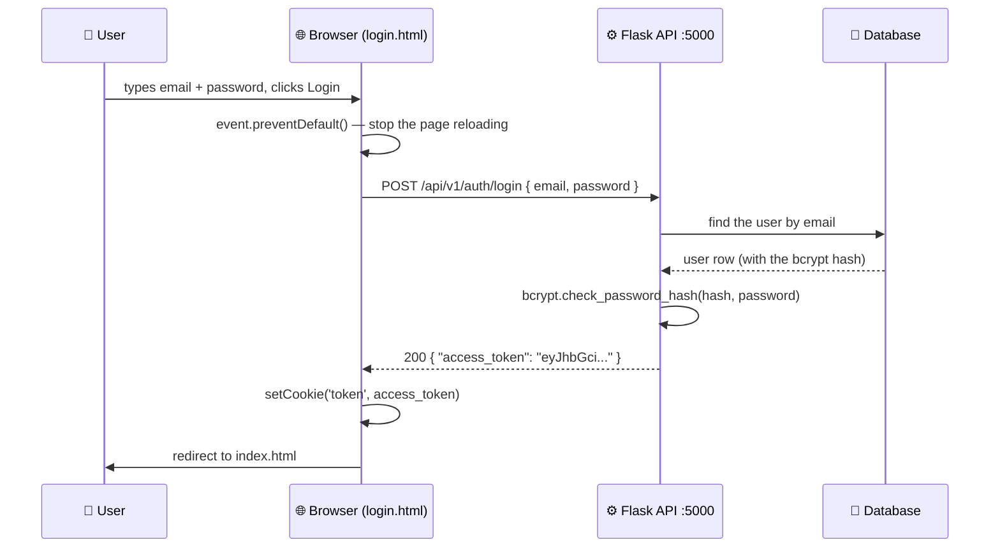
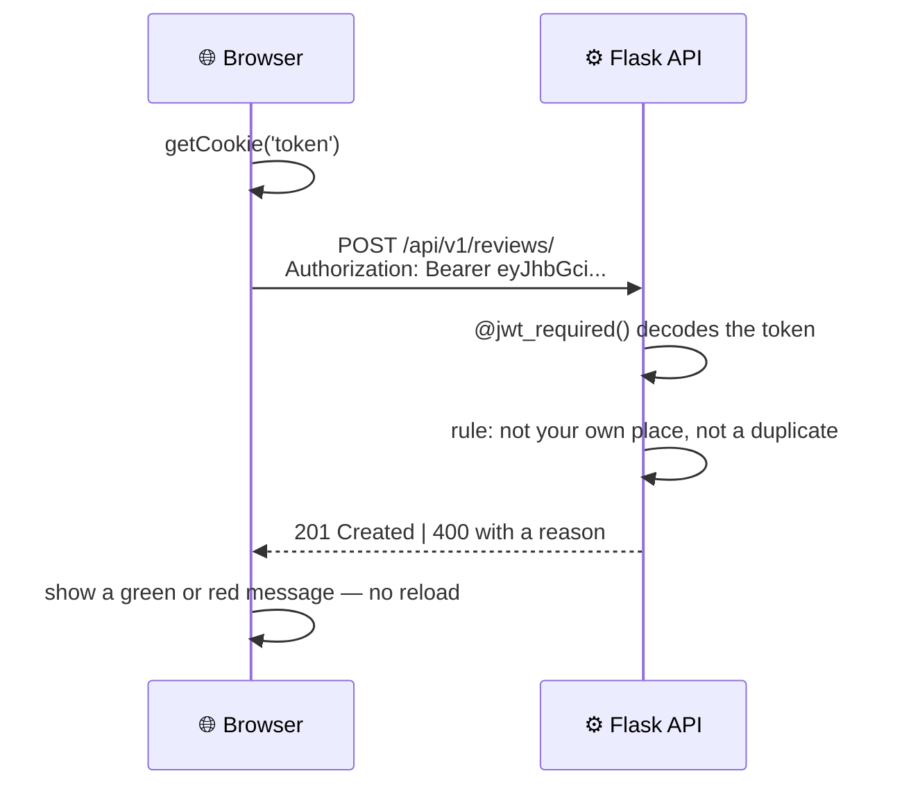

<div align="center">

# 🌊 HBnB — Part 4: Simple Web Client

**The front end that finally makes the API visible.**

[](https://developer.mozilla.org/en-US/docs/Web/HTML)
[](https://developer.mozilla.org/en-US/docs/Web/CSS)
[](https://developer.mozilla.org/en-US/docs/Web/JavaScript)
[](https://developer.mozilla.org/en-US/docs/Web/API/Fetch_API)
[](https://validator.w3.org/)

</div>

---

## 📖 Contents

- [What Part 4 is about](#-what-part-4-is-about)
- [What was built](#-what-was-built)
- [Project structure](#-project-structure)
- [How the front end talks to the API](#-how-the-front-end-talks-to-the-api)
- [Task 1 — Login](#-task-1--login)
- [Task 2 — List of places & filtering](#-task-2--list-of-places--filtering)
- [Task 3 — Place details](#-task-3--place-details)
- [Task 4 — Add review](#-task-4--add-review)
- [The design system](#-the-design-system)
- [Security decisions](#-security-decisions)
- [Running the project](#-running-the-project)
- [Test accounts](#-test-accounts)
- [How to test the login functionality](#-how-to-test-the-login-functionality)
- [How to test the list of places and filtering](#-how-to-test-the-list-of-places-and-filtering)
- [How to test the place details page](#-how-to-test-the-place-details-page)
- [How to test the add review functionality](#-how-to-test-the-add-review-functionality)
- [Design notes](#-design-notes)
- [Notes on CORS](#-notes-on-cors)

---

## 🌍 What Part 4 is about

Parts 1 to 3 produced an API. An API is invisible — the only way to see it working was
Swagger or a `curl` command. **Part 4 gives it a face.**

This folder is a complete client built with **HTML5, CSS3 and vanilla JavaScript ES6** —
no React, no jQuery, no build step. A visitor can browse places, log in, open a place's
details with its reviews, and post a review of their own. Every one of those actions goes
out over the **Fetch API** to the Part 3 backend, and **not a single page ever reloads**.

The backend from Part 3 is copied in here unchanged (plus CORS), so this one folder runs
the whole stack.

**Why vanilla JavaScript?** Because the point of the task is to understand what a framework
does *for* you: fetching, parsing JSON, building DOM nodes, storing a token, guarding a form.
Once you have written those by hand, React stops being magic.

---

## 🧱 What was built

| # | Task | What the user sees | Where it lives |
|---|---|---|---|
| 1 | **Login** | A form that exchanges email + password for a JWT, stores it in a cookie, and redirects | `login.html` · `initLogin()` |
| 2 | **List of places** | Six cards loaded live from the API, with a client-side price filter | `index.html` · `fetchPlaces()` |
| 3 | **Place details** | One place's full information, amenities and reviews, chosen by URL parameter | `place.html` · `initPlaceDetails()` |
| 4 | **Add review** | A guarded form that POSTs a new review with the JWT attached | `add_review.html` · `initReviewForm()` |

Plus the parts that were not on the task list but make it feel finished:

- **Logout** — the Login button turns into Logout the moment a token exists
- **Graceful offline mode** — if the API is down, the page shows sample cards and a clear
  yellow notice instead of an empty white screen
- **Real error states** — "Place not found" for a bad id, a readable message for a failed
  login, a specific message when the server is unreachable
- **A full visual identity** — navy palette, Poppins, hotel photography, the official HBnB
  logo and amenity icons

**Size of the work:** 551 lines of JavaScript · 692 lines of CSS · 596 lines of HTML across four pages.

---

## 📁 Project structure

```
part4_shouq/
│
├── index.html          # Task 2 — list of places + price filter
├── login.html          # Task 1 — login form
├── place.html          # Task 3 — place details + reviews + inline review form
├── add_review.html     # Task 4 — standalone add-review page
├── styles.css          # All styling (navy theme, 692 lines)
├── scripts.js          # All client logic, tasks 1–4 (551 lines)
├── images/             # Logo, favicon, amenity icons, hotel photography, avatars
│
├── app/                # ⬅ the API, copied from Part 3
│   ├── api/v1/         # Endpoints (Flask-RESTx)
│   ├── models/         # SQLAlchemy models
│   ├── services/       # Facade
│   └── persistence/    # Repositories
├── config.py           # Development / Testing / Production configs
├── run.py              # API entry point
├── create_admin.py     # Creates the first admin account
├── seed_data.py        # Fills the database with demo data
└── requirements.txt
```

**Where each task lives in `scripts.js`:**

| Task | Functions |
|---|---|
| Shared | `setCookie`, `getCookie`, `deleteCookie`, `getToken`, `isLoggedIn`, `authHeaders`, `escapeHtml`, `showMessage` |
| 1 — Login | `initLogin` |
| 2 — List of places | `fetchPlaces`, `buildPlaceCard`, `renderPlaces`, `applyPriceFilter`, `checkAuthentication`, `showApiNotice` |
| 3 — Place details | `initPlaceDetails`, `renderPlaceDetails`, `renderReviews`, `getPlaceIdFromURL`, `showPlaceError` |
| 4 — Add review | `initReviewForm`, `submitReview` |

**One script for four pages.** `scripts.js` is loaded by every page, and a single
`DOMContentLoaded` listener decides what to run. Each `init` function begins by checking
whether the element it needs exists:

```javascript
function initLogin () {
  const form = document.getElementById('login-form');
  if (!form) return;          // ⬅ not the login page — do nothing
  ...
}
```

That one guard line is what lets four different pages share one file without errors.

---

## 🔌 How the front end talks to the API

This is the part that ties Parts 1–3 to Part 4. Two separate servers are running:

| Server | Address | Serves |
|---|---|---|
| Web client | `http://localhost:8000` | HTML, CSS, JS, images |
| API | `http://127.0.0.1:5000` | JSON |

The browser downloads the pages from one and the data from the other. Here is a complete
round trip for logging in:



And once the token exists, every protected request carries it:



**The three pieces that make this work:**

**1. `async` / `await` — waiting without freezing**

```javascript
const response = await fetch(`${API_BASE}/places/`);
const places = await response.json();
```

`fetch` returns immediately with a *promise* — a receipt saying "the answer will come".
`await` pauses this function until the answer arrives, while the rest of the page keeps
responding. Two `await`s are needed because the reply arrives in two stages: first the
headers, then the body.

**2. `authHeaders()` — the ID card**

```javascript
function authHeaders () {
  const token = getToken();
  return token ? { Authorization: `Bearer ${token}` } : {};
}
```

HTTP is stateless: the server forgets you between requests. The JWT is proof of who you are,
resent on every protected call. If there is no token this returns `{}`, so public endpoints
still work.

**3. `event.preventDefault()` — the reason nothing reloads**

A `<form>` element's native behaviour is to reload the page. `preventDefault()` cancels it,
and JavaScript sends the data instead. This single line is the difference between a 1998
website and a single-page app.

**CORS is the fourth piece.** By default the browser refuses to let `localhost:8000` read a
response from `127.0.0.1:5000` — different port means different origin. The API grants
permission explicitly; see [Notes on CORS](#-notes-on-cors).

---

## 🔑 Task 1 — Login

`login.html` + `initLogin()`

```javascript
const response = await fetch(`${API_BASE}/auth/login`, {
  method: 'POST',
  headers: { 'Content-Type': 'application/json' },
  body: JSON.stringify({ email, password })
});

if (response.ok) {
  const data = await response.json();
  setCookie('token', data.access_token);
  window.location.href = 'index.html';
} else {
  showMessage(form, 'Invalid email or password. Please try again.');
}
```

**Points worth noticing:**

- `JSON.stringify` converts the JavaScript object into the text HTTP can carry.
  `Content-Type: application/json` tells Flask how to read it back.
- `response.ok` is `true` for any 2xx status. A `401` does **not** throw — `fetch` only
  rejects when the network itself fails, which is why there is both an `if (!response.ok)`
  branch *and* a `try/catch`.
- The token goes into a **cookie** rather than a variable, because a variable is erased the
  moment the browser navigates to `index.html`.

**Cookie helpers:**

```javascript
function setCookie (name, value, days = 1) {
  const expires = new Date(Date.now() + days * 864e5).toUTCString();
  document.cookie = `${name}=${encodeURIComponent(value)}; expires=${expires}; path=/`;
}
```

`864e5` is 86 400 000 ms — one day. `path=/` makes the cookie readable on every page of the
site, not just `login.html`. Deleting a cookie is done by setting its expiry to **1970**.

---

## 🏠 Task 2 — List of places & filtering

`index.html` + `fetchPlaces()`, `buildPlaceCard()`, `applyPriceFilter()`

**Fetching:**

```javascript
async function fetchPlaces () {
  const response = await fetch(`${API_BASE}/places/`, { headers: authHeaders() });
  const places = await response.json();
  renderPlaces(places);
}
```

**Building a card** — the API returns raw JSON, and JavaScript turns each object into HTML:

```javascript
function buildPlaceCard (place, index) {
  const article = document.createElement('article');
  article.className = 'place-card';
  article.dataset.price = Number(place.price) || 0;   // ⬅ the filter reads this later
  article.innerHTML = `...${escapeHtml(place.title)}...`;
  return article;
}
```

`dataset.price` writes a `data-price` attribute onto the element. The price is stored on the
card itself, so filtering never needs to call the API again.

**Filtering happens entirely in the browser:**

```javascript
function applyPriceFilter () {
  const max = document.getElementById('price-filter').value;
  document.querySelectorAll('.place-card').forEach((card) => {
    const price = Number(card.dataset.price);
    const show = max === 'all' || price <= Number(max);
    card.style.display = show ? '' : 'none';
  });
}
```

The cards are never deleted — only hidden with `style.display`. Switching back to **All**
brings them straight back, with **zero network requests**. Options are `10`, `50`, `100`
and `All`, as the specification requires.

**If the API is offline,** `fetchPlaces` catches the error, renders six sample cards and
calls `showApiNotice()` to explain why — a broken backend produces an honest message, not a
blank page.

---

## 📍 Task 3 — Place details

`place.html` + `initPlaceDetails()`

The details page has no idea which place to show until it reads the URL:

```javascript
function getPlaceIdFromURL () {
  return new URLSearchParams(window.location.search).get('place_id');
}
```

For `place.html?place_id=abc-123` this returns `"abc-123"`. That is how one HTML file serves
every place in the database — the same trick every real site uses.

```javascript
const placeId = getPlaceIdFromURL();
const response = await fetch(`${API_BASE}/places/${placeId}`, { headers: authHeaders() });

if (!response.ok) return showPlaceError('Place not found');
```

`showPlaceError()` replaces the contents of `#place-details` with a clear message and a link
back to the list, so a wrong id never leaves stale information on screen.

**Reviews** are rendered by `renderReviews()`, and the **Add review** section is shown only
when `isLoggedIn()` is true — a logged-out visitor can read reviews but not write one.

---

## 📝 Task 4 — Add review

`add_review.html` + `initReviewForm()`, `submitReview()`

```javascript
const response = await fetch(`${API_BASE}/reviews/`, {
  method: 'POST',
  headers: { 'Content-Type': 'application/json', ...authHeaders() },
  body: JSON.stringify({ text, rating: Number(rating), place_id: placeId })
});
```

`...authHeaders()` is the **spread operator**: it unpacks the `Authorization` key into the
same object as `Content-Type`. If there is no token it unpacks nothing, and the request
simply goes out unauthenticated.

**The page is guarded before it even renders:**

```javascript
if (!isLoggedIn()) {
  window.location.href = 'index.html';
  return;
}
```

This is *convenience*, not security — the real check is `@jwt_required()` on the API. The
redirect just spares the user filling in a form that was always going to be rejected.

**The business rules live on the server**, and the client only reports them:

| The server refuses when… | Message shown |
|---|---|
| You review your own place | "You cannot review your own place" |
| You review the same place twice | "You have already reviewed this place" |
| The rating is not 1–5 | "Rating must be an integer between 1 and 5" |

Those rules are enforced in the Part 3 models and facade — the front end never decides them.

---

## 🎨 The design system

The specification fixes a handful of values and leaves the rest open. What is here is a
**calm navy palette**, chosen to look like a place you would actually want to stay.

**Every colour is a CSS variable**, declared once in `:root`:

```css
:root {
  --navy-900: #0B1626;   /* deepest — header, footer */
  --navy-700: #1B3557;
  --blue-500: #3E6B96;   /* primary accent */
  --blue-100: #E4EBF3;   /* soft background tint */
  --sand:     #DCC69F;   /* warm contrast — prices, stars */
  --cream:    #F4F7FA;   /* page background */
  --text:     #17263A;
  --muted:    #6D8098;
  --ok:       #2E7D62;   /* success */
  --err:      #C0483F;   /* error */
}
```

Used everywhere as `color: var(--text)`. Changing one line in `:root` restyles all four
pages at once — this is what a design system means in practice.

**Depth comes from three shadow tokens**, not from borders:

```css
--sh-sm: 0 4px 16px rgba(11, 22, 38, .07);   /* resting card */
--sh-md: 0 12px 34px rgba(11, 22, 38, .13);  /* hover */
--sh-lg: 0 24px 60px rgba(11, 22, 38, .20);  /* hero */
```

The shadows are tinted navy rather than black, so they read as *soft light* instead of dirt.

**Layout** is flexbox throughout. `.places-list` uses `display: flex; flex-wrap: wrap`,
which is why cards reflow into fewer columns on a narrow screen without any JavaScript.
`object-fit: cover` keeps every photo the same height without squashing it.

**Type** is **Poppins** (300–700) from Google Fonts, with `preconnect` so the font starts
downloading before the CSS finishes parsing.

**Imagery** is real hotel photography for the places, plus the official `logo.png`,
`icon.png` and the `icon_wifi` / `icon_bed` / `icon_bath` amenity icons from the provided
base files.

---

## 🔒 Security decisions

**Every value from the API is escaped before it touches the page.**

```javascript
function escapeHtml (value) {
  return String(value ?? '')
    .replace(/&/g, '&amp;').replace(/</g, '&lt;').replace(/>/g, '&gt;')
    .replace(/"/g, '&quot;').replace(/'/g, '&#39;');
}
```

Without it, a review containing `<script>` would be **executed** by the browser instead of
displayed. That is a stored XSS attack. Escaping turns the tags into harmless text.
It is applied to every place title, description, host name, amenity and review body.

**Login errors are deliberately vague.** The message is always *"Invalid email or password"*
— never "this email does not exist". A precise error would let an attacker discover which
addresses are registered.

**The token lives in a cookie, not in a variable,** because a variable dies on navigation.
The trade-off is that JavaScript can read the cookie; a production site would add `HttpOnly`
and `Secure`, but `HttpOnly` would stop `fetch` from reading it here, which the task requires.

**Client-side guards are convenience only.** Hiding a form or redirecting a logged-out user
is a nicety — anyone can call the API directly with `curl`. The real enforcement is
`@jwt_required()` and the ownership rules in the Part 3 facade.

---

## 🚦 Running the project

You need **two terminals open at the same time**, both inside `part4_shouq/`.

**1. Install the dependencies (once):**

```bash
python -m pip install -r requirements.txt
```

**2. Terminal one — start the API:**

```bash
python seed_data.py     # fills the database with demo data
python run.py           # starts the API on http://127.0.0.1:5000
```

**3. Terminal two — serve the web client:**

```bash
python -m http.server 8000
```

**4. Open the site:**

```
http://localhost:8000/index.html
```

> The pages must be served over `http://`, not opened as a `file://` path —
> browsers block API requests coming from local files.
> Swagger documentation for the API is available at `http://127.0.0.1:5000/api/v1/`.

---

## 👥 Test accounts

`seed_data.py` creates these:

| Email | Password | Role |
|---|---|---|
| `admin@test.com` | `123456` | Administrator |
| `sara@test.com` | `pass1234` | Owns all the demo places |
| `omar@test.com` | `pass1234` | Owns nothing — use this one to post reviews |

> A user cannot review their own place, so log in as **omar** when testing reviews.

---

## 🧪 How to test the login functionality

**Successful login**

1. Open `http://localhost:8000/login.html`
2. Enter `omar@test.com` / `pass1234` and press **Login**.
3. You are redirected to `index.html`.
4. Confirm the token was stored: press <kbd>F12</kbd> → **Application** → **Cookies** →
   `http://localhost:8000`. You should see a cookie named **`token`** holding the JWT.
5. On the main page the **Login** button is now hidden and a **Logout** button appears
   in its place — this is the behaviour the spec requires.

**Failed login**

1. Go back to `login.html` and enter a wrong password.
2. An error message appears under the form: *"Invalid email or password. Please try again."*
3. No cookie is created and you stay on the page.

**API offline**

1. Stop the API (<kbd>Ctrl</kbd>+<kbd>C</kbd> in terminal one) and try to log in.
2. The form shows *"Could not reach the API. Is the server running?"* instead of failing silently.

**Logout**

- Click **Logout** — the cookie is deleted and the **Login** button comes back.

---

## 🧪 How to test the list of places and filtering

1. Open `http://localhost:8000/index.html`.
2. Six place cards are loaded **from the API** — each with an image, name, price and a
   **View Details** button.
3. Use the **Max price per night** dropdown:
   - `10` → no places match, the counter reads *"No places match this price."*
   - `50` → only places priced up to $50
   - `100` → places priced up to $100
   - `All` → all six come back
4. Notice the page never reloads — filtering is done in the browser by toggling
   `style.display` on each card.
5. If the API is not running, the page falls back to sample cards and shows a yellow
   notice explaining why, instead of appearing broken.

---

## 🧪 How to test the place details page

1. From the main page click **View Details** on any card.
2. The URL becomes `place.html?place_id=<id>` and the page shows that place's
   title, host, price, description, amenities and its reviews.
3. **Invalid id:** open `place.html?place_id=does-not-exist` — the page shows
   *"Place not found"* with a link back to the list, rather than stale content.
4. **Not logged in:** the *Add your review* form is hidden.
5. **Logged in:** the form is visible.

---

## 🧪 How to test the add review functionality

**Posting a review (happy path)**

1. Log in as `omar@test.com` / `pass1234`.
2. Open a place owned by Sara, for example **Seaside Calm Apartment**.
3. Scroll to *Add your review*, or open the standalone page from the
   *"Open the review form"* link.
4. Write a comment, pick a rating, press **Submit review**.
5. A green message appears: *"Thank you! Your review has been added."* and the form clears.
6. Reload the place page — your review is listed. You can also confirm it was stored by
   opening `http://127.0.0.1:5000/api/v1/reviews/` in a browser tab.

**Error cases**

| What you do | What should happen |
|---|---|
| Submit with an empty comment or no rating | *"Please write a review and choose a rating."* |
| Review the **same place twice** | `400` — *"You have already reviewed this place"* |
| Review a place **you own** (log in as `sara@test.com`) | `400` — *"You cannot review your own place"* |
| Open `add_review.html` while logged out | You are redirected to `index.html` |
| Stop the API and submit | *"Could not reach the API. Is the server running?"* |

---

## 📐 Design notes

The layout follows the required structure while using a custom palette, which the
task explicitly allows.

**Fixed values required by the specification** — applied to both `.place-card` and
`.review-card`:

```css
margin: 20px;
padding: 10px;
border: 1px solid #ddd;
border-radius: 10px;
```

**Required classes and ids used:**
`logo` · `login-button` · `login-link` · `places-list` · `price-filter` ·
`place-card` · `details-button` · `place-details` · `place-info` · `review-card` ·
`add-review` · `form`

**Free choices made here:** a calm navy palette, the **Poppins** font, hotel
photography for the places, and the official `logo.png`, `icon.png` and the
`icon_wifi` / `icon_bed` / `icon_bath` amenity icons from the provided base files.

All four pages pass the [W3C validator](https://validator.w3.org/) with no errors.

---

## 🌐 Notes on CORS

The browser blocks requests from `localhost:8000` to `127.0.0.1:5000` unless the API
allows it. This is already handled in `app/__init__.py`:

```python
from flask_cors import CORS

CORS(app, resources={r"/api/*": {"origins": "*"}})
```

**Why the browser does this:** without CORS, any website you visited could quietly read your
data from any API you happened to be logged into. The rule is that a server must *explicitly*
say who is allowed to read its responses. `origins: "*"` means "anyone", which is fine for a
school project on `localhost` but would be narrowed to a specific domain in production.

If you ever see a `CORS policy` error in the browser console, it means the API is
running without this configuration.

---

<div align="center">

**Part 4 of the HBnB project** · Holberton School — Full-Stack Software Engineering

</div>
